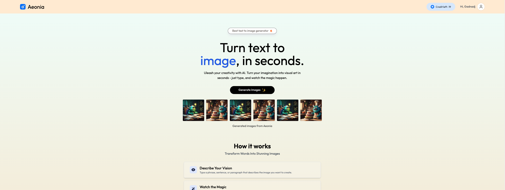
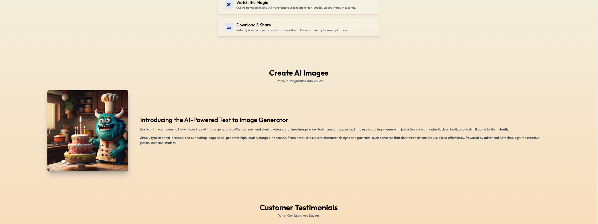
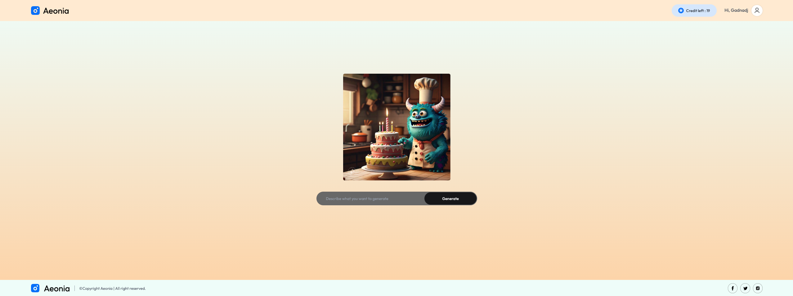
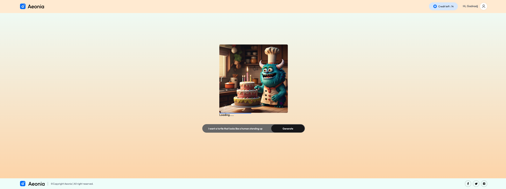
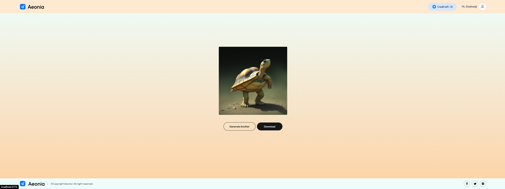

# 🌟 [Aeonia Image Generator]

Aeonia Image Generator is a modern web application that allows users to generate images from custom prompts. This project uses React, TypeScript, Tailwind CSS, and an Express backend with MongoDB to manage users and generate images through an external API.

---

## 🖼️ **Screenshot**








## 🚀 **Features**

🖼️ Image Generation: Users can generate images from custom prompts using an external image generation API.

👤 User Management: Create and manage user accounts with a credit balance for generating images.

💳 Image Credits: Users can use credits to generate images, with credits deducted after each generation.

📥 Download Images: Users can download the generated images directly to their device.

🌍 Responsive Design: Optimized for all devices and screen sizes.

🔐 Authentication: Secure user authentication using JWT tokens.

🖱️ Interactive UI: Smooth animations and a user-friendly interface for an enjoyable experience.

---

## 🛠️ **Tech Stack**

| **Category**   | **Technologies**                         |
|----------------|------------------------------------------|
| Frontend       | React, TypeScript, Tailwind CSS          |
| Backend        | Node.js, Express                         |
| Database       | MongoDB                                  |
| API	           | ClipDrop API                             |
| Authentication | JSON Web Tokens (JWT)                    |

---

## 💻 **Installation**

1. Clone the repository:

   ```bash
   git clone https://github.com/gadnadj/Aeonia-Ai-Image-Generator.git
   git clone https://github.com/gadnadj/Aeonia-Backend.git

   
4. Navigate to the project directory in two different terminals:

   ```bash
   
   cd Aeonia-Frontend
   cd Aeonia-Backend

5. Install dependencies for the two terminals:

   ```bash
   
   npm install

7. Start the development server in the backend terminal:

   ```bash
   nodemon server.js

8. Start the development in the frontend terminal:

   ```bash
   npm run dev

9. Open your browser and navigate to:

   ```bash
   http://localhost:5173

In the project directory, you can run:

npm run dev: Start the development server.
npm run build: Build the project for production.
npm run preview: Preview the production build.
